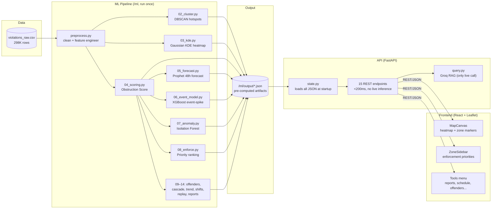
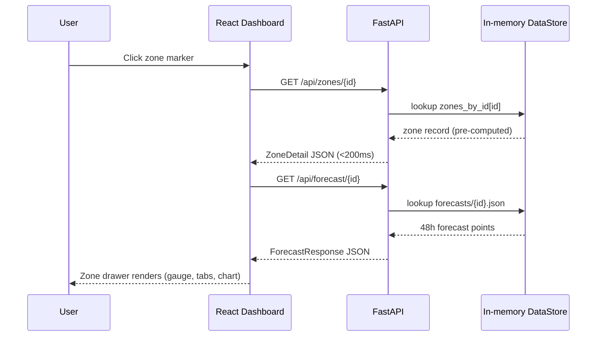
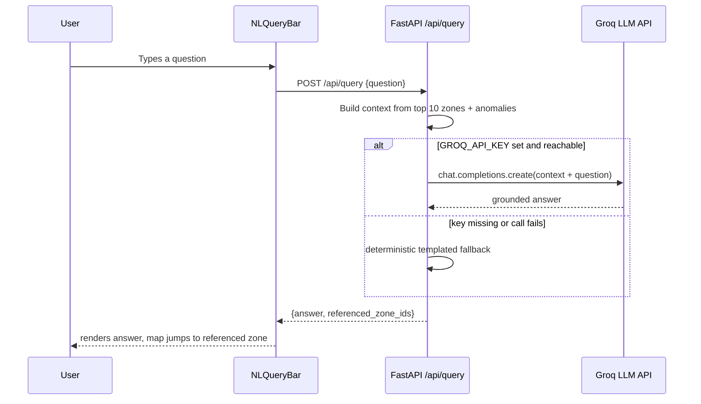
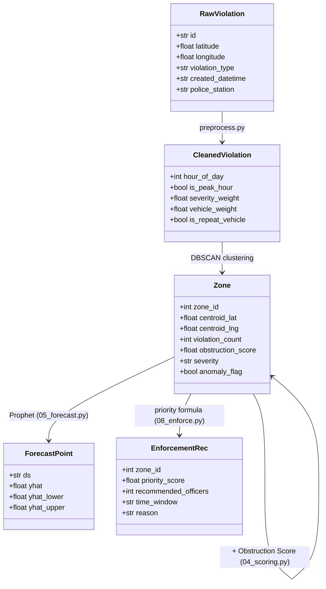

# ClearLane AI — AI-Driven Parking Intelligence & Congestion Impact Platform

**Problem:** Bengaluru Traffic Police record ~300K parking violations but have no way to
see which violations are actually choking traffic, where, or when. Enforcement is
patrol-based and reactive.

**Solution:** ClearLane AI turns a raw 298K-row violation CSV into a live enforcement
dashboard — DBSCAN-clustered hotspot zones, a custom Obstruction Score, 48-hour Prophet
forecasts, anomaly detection, and a ranked, AI-explainable enforcement priority list —
served through a FastAPI backend and a React/Leaflet map dashboard.

---

## Table of contents

- [Features](#features)
- [Architecture](#architecture)
- [How a request flows through the system](#how-a-request-flows-through-the-system)
- [ML pipeline data flow](#ml-pipeline-data-flow)
- [Tech stack](#tech-stack)
- [Project structure](#project-structure)
- [Instructions to run](#instructions-to-run)
- [API reference](#api-reference)
- [Known limitations](#known-limitations)
- [Further docs](#further-docs)

---

## Features

| # | Feature | What it does |
|---|---|---|
| 1 | **Hotspot zones** | DBSCAN clusters 115K violations into 179 geographic hotspot zones |
| 2 | **Live heatmap** | Gaussian KDE density surface rendered on the map |
| 3 | **Obstruction Score** | 0–100 composite score (density, severity, duration, road centrality) per zone |
| 4 | **48h forecast** | Prophet time-series forecast for the top 30 zones |
| 5 | **Event-spike model** | XGBoost regressor predicting violation spikes near events |
| 6 | **Anomaly detection** | Isolation Forest flags statistically unusual zones |
| 7 | **Enforcement engine** | Ranks top-10 zones by priority, recommends officer count + time window |
| 8 | **NL Query (AI assistant)** | Ask questions in plain English, answered by Groq (`llama-3.3-70b`) grounded in real data |
| 9 | **Repeat-offender leaderboard** | Vehicles with the most recorded violations, globally and per zone |
| 10 | **Zone comparison** | Side-by-side comparison of any two zones |
| 11 | **Patrol sheet export** | One-click CSV download of the enforcement list |
| 12 | **Cascade risk graph** | NetworkX model of how congestion spills between nearby zones |
| 13 | **Historical trend view** | Monthly violation trend per zone with worsening/improving labels |
| 14 | **Officer shift optimizer** | Greedy allocation of a fixed officer pool across 4 daily shifts |
| 15 | **Timeline replay** | Animated hour-by-hour playback of the typical violation pattern |
| 16 | **Report generator** | Daily/weekly/monthly report — trend, KPIs, suggestions, **PDF export** |

Full technical detail (exact formulas, model parameters, which script produces what) is
in **[docs/FEATURES.md](docs/FEATURES.md)**.

---

## Architecture



---

## How a request flows through the system

Sequence for the most common interaction — a user clicks a zone on the map:



And the one endpoint that *does* call a live external service:



---

## ML pipeline data flow

Class/data-model view of the core pipeline objects and how they relate:



---

## Tech stack

| Layer | Technology |
|---|---|
| Data processing | pandas, numpy |
| Clustering / density | scikit-learn (DBSCAN, Isolation Forest), scipy (Gaussian KDE) |
| Forecasting | Prophet |
| Event modeling | XGBoost |
| Graph analysis | NetworkX (cascade risk), osmnx (road network) |
| API | FastAPI, Pydantic v2, Uvicorn |
| AI assistant | Groq (`llama-3.3-70b-versatile`) |
| Frontend | React 19, TypeScript, Vite, Tailwind CSS v4 |
| Map | React-Leaflet, Leaflet.heat |
| Charts | Recharts |
| State | Zustand |
| Animation | GSAP |
| PDF export | jsPDF, html2canvas (lazy-loaded) |

---

## Project structure

```
gridlock_r2/
├── data/raw/                  # source CSV (gitignored, see Quick Start)
├── ml/                        # pipeline scripts, run in numeric order
│   ├── config.py              # central constants (weights, thresholds, paths)
│   ├── preprocess.py          # cleaning + feature engineering
│   ├── 01_eda.py … 14_report_data.py
│   └── output/                # pre-computed JSON consumed by the API (committed)
├── api/app/
│   ├── main.py                 # FastAPI app, 15 endpoints
│   ├── state.py                # loads all ml/output/*.json once at startup
│   ├── models.py                # Pydantic response contracts
│   ├── query.py                 # Groq RAG for NL query
│   └── report.py               # report aggregation + suggestion rules
├── frontend/src/
│   ├── components/              # React components (MapCanvas, modals, panels)
│   ├── hooks/                   # one fetch hook per endpoint
│   ├── store/useDashboardStore.ts  # Zustand global UI state
│   └── lib/                     # api client, CSV/PDF export helpers
└── docs/
    ├── FEATURES.md               # full feature reference
    ├── eda_findings.md           # EDA output
    └── demo_script.md            # judging walkthrough
```

---

## Instructions to run

### Prerequisites

- Python 3.12 (Prophet/XGBoost wheels are most reliable on 3.12; 3.13/3.14 may not have prebuilt wheels yet)
- Node.js 18+
- (Optional) A [Groq API key](https://console.groq.com) for the AI assistant — the app works without one, falling back to a templated answer

### Option A — Quick start (recommended for reviewers)

The pre-computed ML outputs (`ml/output/*.json`) are **already committed to this repo**,
so you do not need to run the full ML pipeline or install heavy ML libraries (Prophet,
XGBoost, osmnx) just to see the app working.

**1. Clone and get the dataset:**
```bash
git clone git@github.com:sarcaxticlarka/ClearLane-AI.git
cd ClearLane-AI
```
The original CSV isn't in the repo (it's `.gitignore`d as raw data) — if you have it,
place it at `data/raw/violations_raw.csv`. If not, you can skip this for Option A since
the API only reads `ml/output/*.json`, not the raw CSV.

**2. Start the API (lightweight install — no ML libraries needed):**
```bash
python3 -m venv .venv && source .venv/bin/activate   # Windows: .venv\Scripts\activate
pip install fastapi "uvicorn[standard]" pydantic python-dotenv groq
cp .env.example .env   # optionally add GROQ_API_KEY for the AI assistant
uvicorn api.app.main:app --reload --port 8000
```
Verify: open `http://localhost:8000/api/zones` — you should see a JSON array of 179 zones.

**3. Start the frontend (new terminal):**
```bash
cd frontend
npm install
echo "VITE_API_BASE_URL=http://localhost:8000" > .env
npm run dev
```
Open `http://localhost:5173` — the dashboard should load with the map, heatmap, zone
markers, and enforcement sidebar populated.

**4. What to try:**
- Click any zone marker → detail drawer opens (Overview / Trend / Forecast / Offenders tabs)
- Top-right **Tools** menu → Generate Report, Repeat Offenders, Event Impact, Shift Schedule, Export CSV, plus Cascade Risk / Timeline Replay toggles
- Bottom query bar → ask "Which zone needs the most officers right now?"
- Sidebar → click the small `+` on two zone cards to compare them side-by-side

### Option B — Full pipeline (regenerate everything from scratch)

Use this if you want to verify the ML pipeline itself, or modify the source data /
model parameters and regenerate outputs.

> **The raw violation CSV is not in this repo** — it's `.gitignore`d (`data/raw/*.csv`)
> since it's 105MB of row-level vehicle data, which is standard practice to keep out of
> git history. Download it here: **[violations dataset (Google Drive)](https://drive.google.com/file/d/1Xv-rRf2ELxXIBwOJE19WHpNYWJ1qpuBE/view?usp=sharing)**,
> then place it at `data/raw/violations_raw.csv`. It should have the 24 columns
> documented in [docs/FEATURES.md](docs/FEATURES.md) (`id, latitude, longitude, ...,
> validation_status`). If you'd rather skip this, stick to **Option A** — every output
> this pipeline produces is already committed under `ml/output/`.

```bash
python3.12 -m venv .venv && source .venv/bin/activate
pip install -r requirements.txt        # full ML + API stack
cp .env.example .env

cd ml
python 01_eda.py                       # -> docs/eda_findings.md
python preprocess.py                   # -> data/processed/violations_clean.parquet
python 02_cluster.py                   # -> output/zones.geojson, zone_stats.json
python 03_kde.py                       # -> output/kde_points.json
python 04_scoring.py                   # -> output/zone_scores.json (fetches/caches an osmnx road graph — can take a few minutes)
python 05_forecast.py                  # -> output/forecasts/{zone_id}.json
python generate_synthetic_events.py    # -> data/raw/astram_events.csv (SYNTHETIC demo data, see docs/FEATURES.md #14)
python 06_event_model.py               # -> output/event_impacts.json
python 07_anomaly.py                   # -> output/anomalies.json
python 08_enforce.py                   # -> output/enforcement_recs.json
python 09_repeat_offenders.py          # -> output/repeat_offenders.json
python 10_cascade.py                   # -> output/cascade_graph.json
python 11_trend.py                     # -> output/trend_global.json
python 12_optimizer.py                 # -> output/shift_schedule.json
python 13_hourly_heatmap.py            # -> output/hourly_heatmap.json
python 14_report_data.py               # -> output/report_trends.json
cd ..

uvicorn api.app.main:app --reload --port 8000   # in one terminal
cd frontend && npm install && npm run dev        # in another
```

### Running tests / sanity checks

There's no automated test suite; verify manually:
```bash
# API health — should all return 200
for ep in zones heatmap enforcement anomalies cascade trend repeat-offenders shift-schedule; do
  curl -s -o /dev/null -w "$ep: %{http_code}\n" "http://localhost:8000/api/$ep"
done

# Frontend type-check and production build
cd frontend && npx tsc -b --noEmit && npm run build
```

### Deploying (Render + Vercel)

The live deployment uses **Render** for the API and **Vercel** for the frontend:

1. **API on Render** — New Web Service → connect this repo → build command
   `pip install fastapi "uvicorn[standard]" pydantic python-dotenv groq` (lightweight set,
   no ML libraries needed since the API only serves pre-computed JSON) → start command
   `uvicorn api.app.main:app --host 0.0.0.0 --port $PORT`. Set `GROQ_API_KEY` in the
   environment (optional).
2. **Frontend on Vercel** — Import this repo → root directory `frontend` → set
   `VITE_API_BASE_URL` to your Render URL.

**Keeping the free Render instance awake:** Render's free tier sleeps after ~15 minutes
of no inbound traffic, then takes ~50s to cold-start on the next request. Once deployed,
set these two extra env vars on the **Render** service (not locally):
```
SELF_PING_URL=https://<your-app>.onrender.com
SELF_PING_INTERVAL_SECONDS=600
```
The API ([api/app/keepalive.py](api/app/keepalive.py)) then pings its own public
`/api/health` endpoint every 10 minutes in a background task — comfortably under the
15-minute sleep threshold — so it never goes idle long enough to spin down. This is a
no-op anywhere `SELF_PING_URL` is unset (local dev included). Note the interval must
stay under ~15 minutes; a longer interval would let it sleep before the next ping fires.

---

## API reference

15 endpoints, all pre-computed JSON except `POST /api/query` (full detail in [docs/FEATURES.md](docs/FEATURES.md)):

| Endpoint | Feature |
|---|---|
| `GET /api/zones`, `/api/zones/{id}` | hotspot zones + obstruction score |
| `GET /api/heatmap` | KDE heatmap |
| `GET /api/forecast/{id}` | 48h Prophet forecast |
| `GET /api/anomalies` | Isolation Forest anomalies |
| `GET /api/enforcement` | ranked enforcement recommendations |
| `GET /api/events/impact` | event-spike impacts (⚠ synthetic, see below) |
| `POST /api/query` | NL query (Groq RAG) |
| `GET /api/repeat-offenders`, `/api/zones/{id}/repeat-offenders` | repeat-offender leaderboard |
| `GET /api/cascade` | cascade risk graph |
| `GET /api/trend`, `/api/zones/{id}/trend` | historical monthly trend |
| `GET /api/shift-schedule` | officer assignment optimizer |
| `GET /api/heatmap/hourly` | timeline replay (typical hour-of-day pattern) |
| `GET /api/report?period=daily\|weekly\|monthly` | report generator (trend, suggestions, PDF export) |

Set `GROQ_API_KEY` in `.env` to enable the NL query endpoint's Groq-backed RAG (model:
`llama-3.3-70b-versatile`); without it, `/api/query` falls back to a deterministic
templated answer built from the same zone/enforcement/anomaly data.

---

## Known limitations

- **No real Astram events export was ever provided.** `python ml/generate_synthetic_events.py`
  fabricates a plausible demo CSV (real Bengaluru venues, randomized dates/crowd sizes,
  tagged `is_synthetic=true`) so the event-spike XGBoost model and the "Event Impact"
  panel work end-to-end. The UI shows a visible synthetic-data warning whenever this
  flag is set. To use real data, replace `data/raw/astram_events.csv` with a genuine
  export (same columns, omit `is_synthetic` or set it `false`) and re-run `06_event_model.py`.
- `closed_datetime` is 100% null in the source CSV, so `duration_est_mins` is a
  documented severity-based proxy rather than an observed duration (see `ml/config.py`).
- DBSCAN zone count (179) and KDE point count (~11K) were auto-tuned at pipeline run
  time to land inside the documented target ranges (50-200 zones, 10K-30K points).
- No automated test suite — verification is manual (see "Running tests" above).

## Further docs

- **[docs/FEATURES.md](docs/FEATURES.md)** — every feature's exact method/formula, API endpoint, and UI location
- **[docs/eda_findings.md](docs/eda_findings.md)** — full exploratory data analysis output
- **[docs/demo_script.md](docs/demo_script.md)** — 90-second judging walkthrough + extended feature tour
